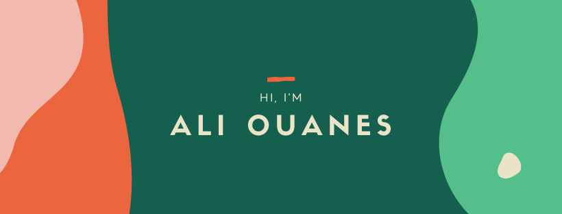

   

  

- 🔭 I’m currently working on **Flutter Project**

- 📫 How to reach me **ouanesali67@gmail.com**

<h2>🛠 My Toolkit</h2>

 
	 
	 
	 
	 
	 
	     
	 
	 
	 
	 
	 

<h2>🏆 Github Stats</h2> 

 
	
	
  	

